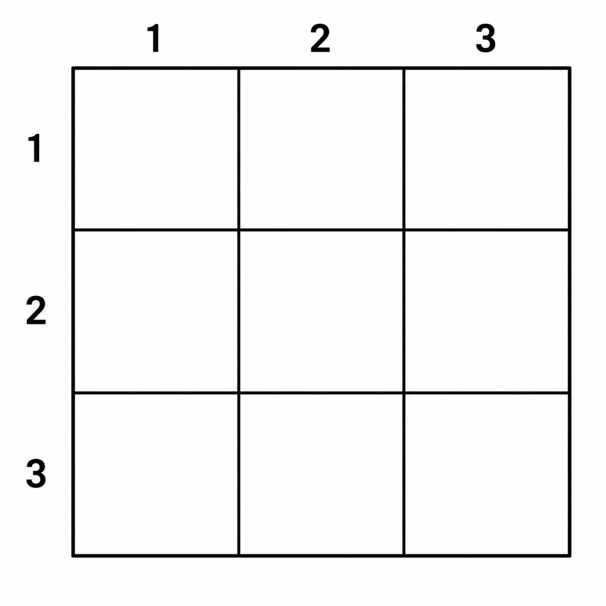

<h1 align="center">Jogo da Velha em C</h1>

Projeto desenvolvido com base nos conteúdos aprendidos durante o primeiro semestre da universidade.

---

## 📌 Sobre o projeto

Durante o semestre foram estudados conceitos de lógica de programação e fundamentos da linguagem C.  
Com esses conhecimentos, foi desenvolvido um jogo da velha simples utilizando matriz 3x3, interação pelo terminal e escolhas aleatórias para a jogada da máquina.

O jogador escolhe uma posição no tabuleiro e, em seguida, a máquina realiza sua jogada automaticamente.  
Quando uma partida termina com vitória ou empate, o jogo é reiniciado.

---

## 🎮 Formato do tabuleiro

Imagem ilustrativa

    

